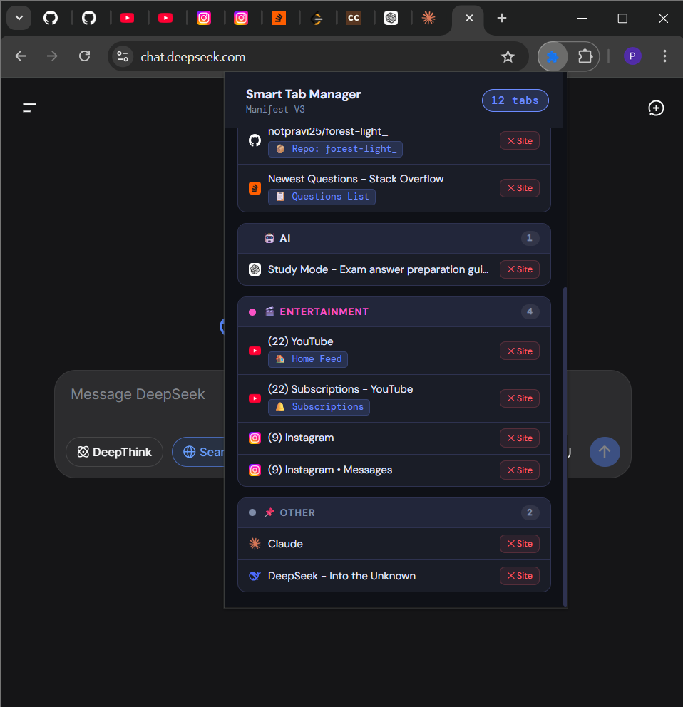
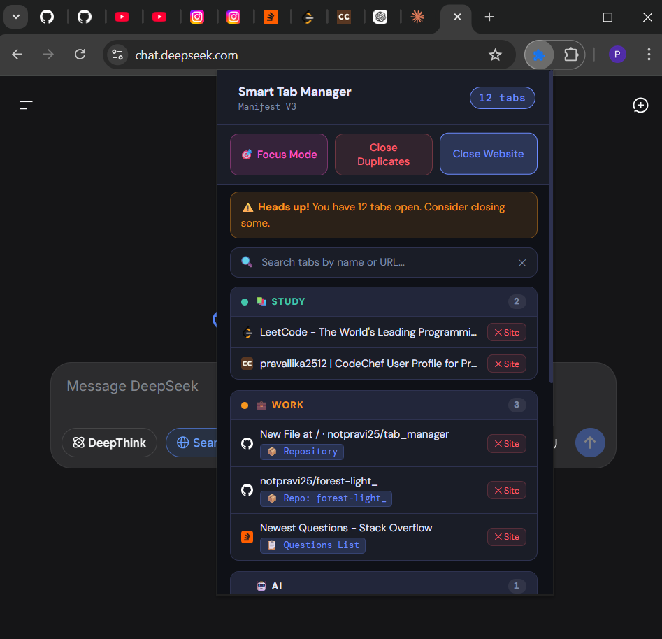
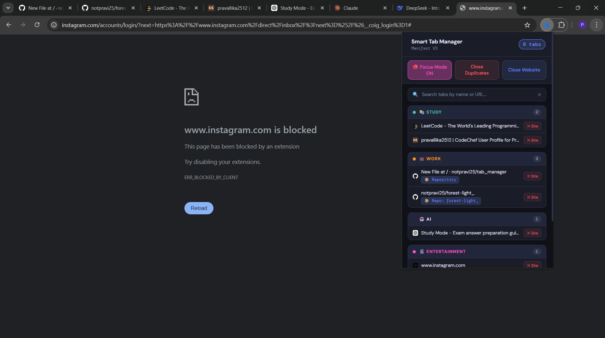

#  Smart Tab Manager (Chrome Extension)

A powerful Chrome extension that helps you **organize, categorize, and manage browser tabs efficiently**.

Smart Tab Manager automatically groups tabs into meaningful categories and provides productivity tools to reduce clutter and improve focus.

---

# ✨ Features

### 📂 Automatic Tab Categorization

Tabs are automatically organized into categories:

* 📚 **Study** – educational and learning platforms
* 💼 **Work** – developer tools and productivity apps
* 🤖 **AI** – AI tools and machine learning platforms
* 🎬 **Entertainment** – social media and streaming websites
* 📌 **Other** – uncategorized tabs

---


### 🔍 Smart Tab Search

Quickly find any open tab using the **real-time search bar**.

---

### 🗑 Close Duplicate Tabs

Detect and remove duplicate tabs instantly to keep your browser clean.

---

### 🌐 Close All Tabs from a Website

Close all tabs belonging to a specific domain with a single click.

Example:

Close all:

* GitHub tabs
* YouTube tabs
* Reddit tabs

---

### 🎯 Focus Mode

Block distracting websites such as:

* YouTube
* Netflix
* Reddit
* Instagram

Helps you stay focused while studying or working.

---

### ⏰ Inactive Tab Alerts

Get notifications when a tab has been inactive for too long.

This helps reduce unnecessary memory usage.

---

# 🧠 AI Category

The extension automatically detects popular AI tools such as:

* ChatGPT
* Hugging Face
* Perplexity
* Replicate
* Anthropic
* Midjourney
* Stability AI
* RunPod
* Cohere
* LangChain

Perfect for **AI students and developers**.

---

# 🖼 Interface Preview

## Extension Popup



## Tab Categorization





## Focus Mode


Example categories inside the extension popup:

📚 Study
💼 Work
🤖 AI
🎬 Entertainment
📌 Other


---

# ⚙️ Installation (Manual)

Since this extension is not yet on the Chrome Web Store, you can install it manually.

### Step 1

Download or clone the repository.

### Step 2

Open Chrome and go to:

```
chrome://extensions
```

### Step 3

Enable **Developer Mode** (top right).

### Step 4

Click **Load Unpacked**.

### Step 5

Select the project folder.

The extension will now appear in your Chrome toolbar.

---

# 🏗 Project Structure

```
smart-tab-manager
│
├── manifest.json
├── background.js
├── popup.html
├── popup.js
├── style.css
├── focus_rules.json
│
└── icons
    ├── icon16.png
    ├── icon32.png
    ├── icon48.png
    └── icon128.png
```

---

# 🛠 Technologies Used

* JavaScript
* HTML
* CSS
* Chrome Extension API
* Manifest V3
* Declarative Net Request API

---

---

# 🔒 Privacy & Technical Approach

Smart Tab Manager is designed with **privacy-first principles**.

### URL-Based Classification

The extension categorizes tabs using **URL keyword matching**.
Each open tab's URL is compared against predefined keyword rules to determine its category.

Example logic:

* `github.com` → Work
* `coursera.org` → Study
* `openai.com` → AI
* `youtube.com` → Entertainment

This lightweight classification approach ensures **fast processing without external dependencies**.

### Local Processing Only

All tab analysis is performed **locally within the browser** using the Chrome Extension API.

No tab data is:

* transmitted to external servers
* stored remotely
* tracked for analytics

### No Data Collection

Smart Tab Manager **does not collect, store, or transmit any personal data**.

The extension only uses the following browser permissions:

* `tabs` → read open tab URLs for categorization
* `storage` → store local settings like Focus Mode state
* `notifications` → send inactive tab alerts
* `alarms` → schedule background tab checks

All data remains **inside the user's browser environment**.

### Secure & Lightweight Design

The extension uses **Manifest V3**, ensuring compatibility with Chrome's latest security architecture.

Key APIs used:

* Chrome Tabs API
* Chrome Storage API
* Chrome Alarms API
* Declarative Net Request API

This design keeps the extension **secure, lightweight, and privacy-friendly**.

---


# 🎯 Future Improvements

Planned features:

* AI tab recommendations
* automatic tab grouping
* tab memory optimization
* productivity statistics dashboard
* customizable categories
* Chrome Web Store release

---

# ⭐ Support

If you like this project:

⭐ Star the repository
🐛 Report issues
💡 Suggest improvements

---
